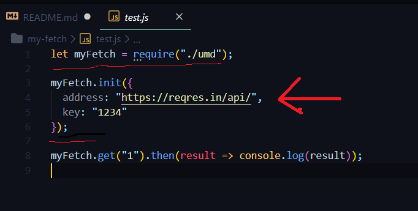
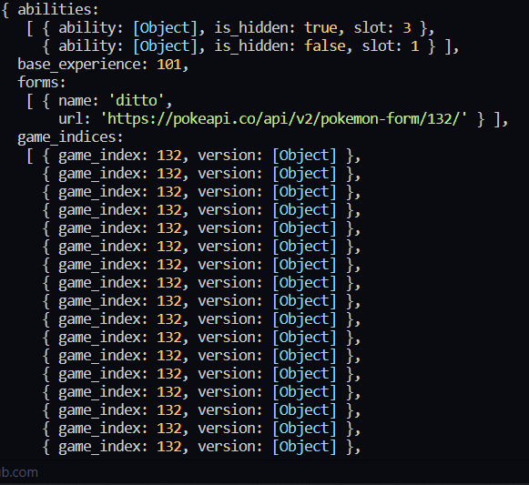

# NodeJS fetch

### Fetch Wrapper that can Fetch Promises in varius ways like brower, XMLHttpRequest or NodeJS

### Includes methods: Post, Get, Delete, Put

## Quick Start

1.  `javascript npm install`

2.  Locate the test.js folder

3.  In the Myfetch function shown below, Place the address you want to Fetch



4.  Run the script `javascript node index`

5.  Success!

## Usage Examples

```javascript
myFetch.init({
address: "https://pokeapi.co/api/v2/
",
key: "1234"
});

myFetch.get("pokemon/ditto/").then(result => console.log(result));
```

Result below



## Contact & Support

JonasWN - Github

jonaswn - NPM

This is a school project but feel free to contact me for any questions!

## Licence

Licence used - MIT
